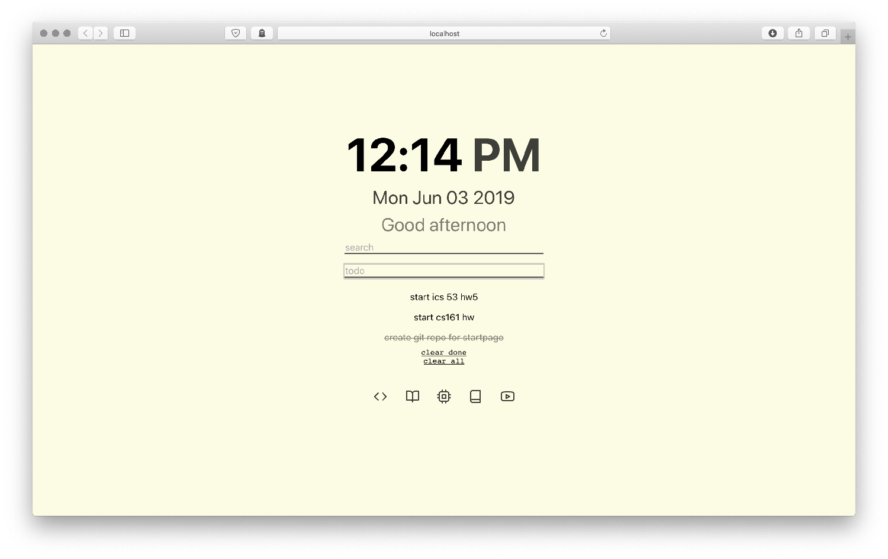
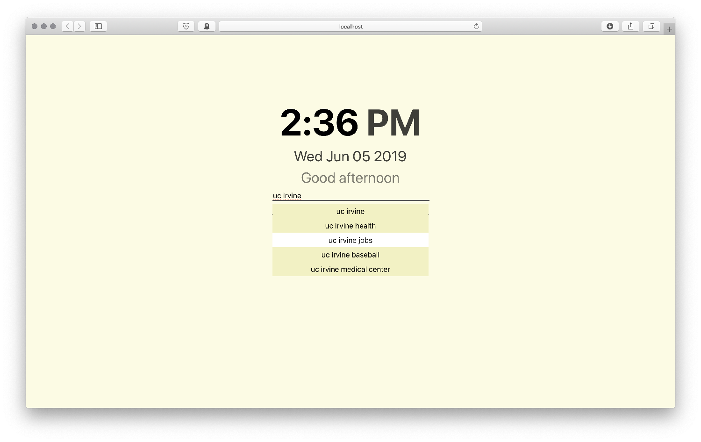

# startpage-todolist

\*react app to display a simple startpage showing the time and an interactive todo list\*\*

i created this app to learn about react and to become more familiar with javascript.

## features

### todo list

-   quickly add items to a todo list with persistent items (using localstorage api)
-   click items to toggle finished/unfinished
-   quickly clear all todo items or all "finished" tiems
-   **TODO**:
    -   ability to delete individual todo items
    -   better hover animation
    -   animate adding todo items

### time

-   simple time/date display with greeting based on time of day

### search

-   searchbar connects to duckduckgo
-   page automatically focuses on search bar for quick searching whenever page is opened
-   displays dropdown with autosuggested results, using the bing search api

#### search shortcuts

-   type `:` into the searchbar followed by a shortcut defined in `src/components/Search.js` to be redirected to websites i find useful :)

### icon shortcuts

-   shortcuts to frequently visited websites

## credits

favicon generated with [favicon.io](https://favicon.io/)

shortcut icons from [feather icons](https://github.com/feathericons/react-feather)
