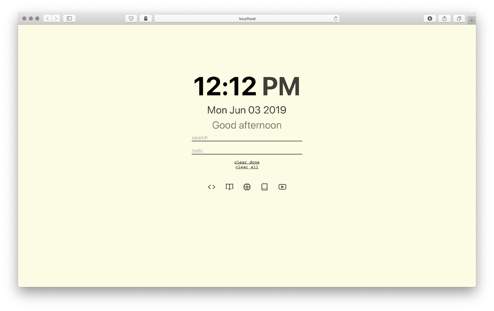

# startpage-todolist

*react app to display a simple startpage showing the time and an interactive todo list**

i created this app to learn about react and to become more familiar with javascript.

## features

### todo list
- quickly add items to a todo list with persistent items (using localstorage api)
- click items to toggle finished/unfinished
- quickly clear all todo items or all "finished" tiems
- **TODO**:
    - ability to delete individual todo items
    - better hover animation
    - animate adding todo items

### time
- simple time/date display with greeting based on time of day

### search
- searchbar connects to bing
- page automatically focuses on search bar for quick searching whenever page is opened

### icon shortcuts
- shortcuts to frequently visited websites
- uses [feather icons](https://github.com/feathericons/react-feather)
- **TODO**
    - animate hover

## usage

- run `npm run-script build`
- move `build/` items into desired directory
- set that directory as your new tab page or homepage!